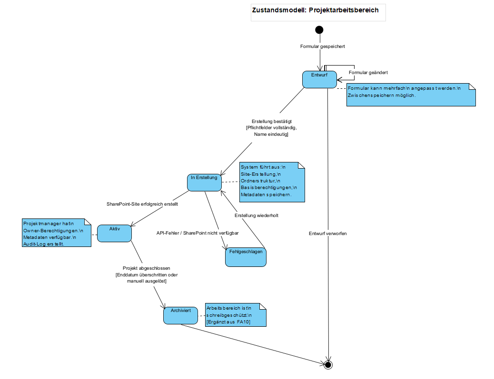

# Zustandsmodell – Projektarbeitsbereich

**Umgesetzte funktionale Anforderungen:**
- **FA01** – Projektarbeitsbereich erstellen (Prioritätsscore: 90)

**Gewählte Klasse:** `Projektarbeitsbereich`  
Die Klasse wurde gewählt, da sie das zentrale Fachkonzept von FA01 darstellt und einen klar definierten Lebenszyklus durchläuft – von der ersten Formulareingabe bis zur Archivierung nach Projektabschluss.

---

## Zustände

### Entwurf
Der Projektmanager hat das Erstellungsformular (teilweise) ausgefüllt und gespeichert. Der Arbeitsbereich existiert noch nicht in SharePoint. Das Formular kann jederzeit geändert oder der Entwurf verworfen werden.

**Herleitung:** FA01, Fehlerbehandlung: „Entwürfe können zwischengespeichert werden"

---

### In Erstellung
Der Projektmanager hat die Erstellung bestätigt (alle Pflichtfelder vollständig, Name eindeutig). Das System führt die Provisionierung in SharePoint aus: Site-Erstellung, Ordnerstruktur aufbauen, Basisberechtigung konfigurieren, Metadaten speichern.

**Herleitung:** FA01, Schritt 5–6: „Projektmanager klickt auf Arbeitsbereich erstellen" / „System erstellt SharePoint-Site"

---

### Aktiv
Die SharePoint-Site wurde erfolgreich erstellt. Der Projektmanager hat Owner-Berechtigung. Die Projekt-Metadaten sind gespeichert und für Reporting verfügbar. Der Arbeitsbereich ist vollständig nutzbar.

**Herleitung:** FA01, Schritt 7–8 und Nachbedingungen

---

### Fehlgeschlagen
Während der Erstellung ist ein technischer Fehler aufgetreten (API-Fehler, SharePoint nicht verfügbar). Der Benutzer wird mit einer aussagekräftigen Fehlermeldung informiert und kann die Erstellung wiederholen.

**Herleitung:** FA01, Fehlerbehandlung: „Bei API-Fehlern oder SharePoint-Nichtverfügbarkeit wird der Benutzer informiert, Anfrage kann später wiederholt werden"

---

### Archiviert
Das Projekt ist abgeschlossen. Der Arbeitsbereich ist schreibgeschützt und wurde in den Archivbereich verschoben. Keine weiteren Änderungen möglich.

**Herleitung:** FA10 – Ergänzt nach Überprüfung des Zustandsmodells, um den vollständigen Lebenszyklus abzubilden. Führte zur Ergänzung des Attributs `status: ArbeitsbereichStatus` in der Klasse `Projektarbeitsbereich` im Fachklassenmodell.

---

## Übergänge

| Von | Nach | Auslöser | Bedingung |
|---|---|---|---|
| [Start] | Entwurf | Formular gespeichert | – |
| Entwurf | Entwurf | Formular geändert | – |
| Entwurf | In Erstellung | Erstellung bestätigt | Pflichtfelder vollständig, Name eindeutig |
| Entwurf | [Ende] | Entwurf verworfen | – |
| In Erstellung | Aktiv | SharePoint-Site erfolgreich erstellt | – |
| In Erstellung | Fehlgeschlagen | Fehler aufgetreten | API-Fehler / SharePoint nicht verfügbar |
| Fehlgeschlagen | In Erstellung | Erstellung wiederholt | – |
| Aktiv | Archiviert | Projekt abgeschlossen | Enddatum überschritten oder manuell ausgelöst |
| Archiviert | [Ende] | – | – |

---

## Ergänzung des Fachklassenmodells

Die Überprüfung des Zustandsmodells ergab, dass das Attribut `status` in `Projektarbeitsbereich` alle fünf Zustände abdecken muss. Die Enumeration `ArbeitsbereichStatus` wurde entsprechend um den Wert `ARCHIVIERT` ergänzt.
